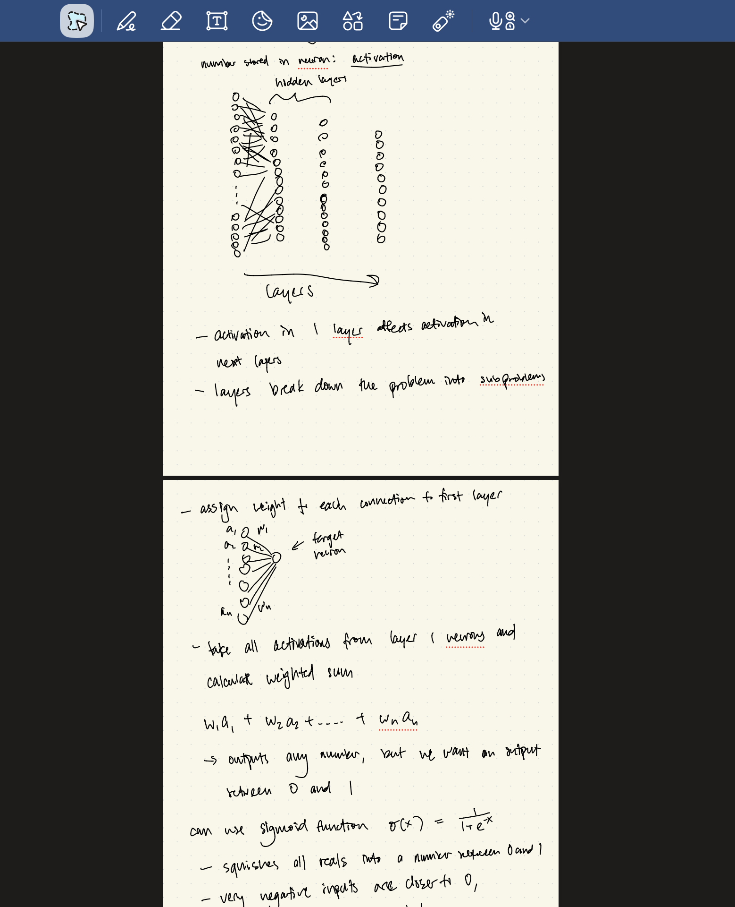
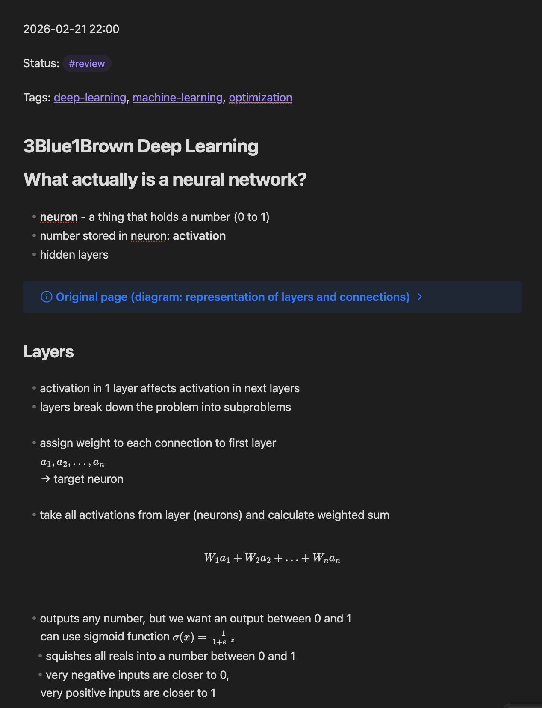

# Obsidian RAG

Obsidian RAG turns handwritten PDF notes (e.g. from GoodNotes) into fully formatted, interlinked Markdown notes in your Obsidian vault automatically.

The pipeline works in four stages: **OCR** sends each PDF page to GPT-4o-mini's vision API, which transcribes handwriting, converts math to LaTeX, and inserts diagram placeholders for any drawings or graphs (which are saved as images and embedded as collapsed callouts). **Retrieval** searches a vector index of your existing vault notes using LlamaIndex and reranks the results with a cross-encoder to find the most relevant notes and tags. **Tag suggestion** runs a two-layer system — retrieval-based suggestions first, then an LLM fallback if confidence is low — to propose wikilinks and hashtags drawn from your existing vault taxonomy. Finally, **note writing** assembles everything into a templated Markdown file and drops it in your designated inbox folder, ready to review.

The index stays current automatically: at startup it diffs every vault file against a manifest and re-embeds only what changed, so manual Obsidian edits are picked up without a full rebuild. Each processed note is also added to the index immediately, so later PDFs in the same session can already retrieve it.

---

| Handwritten PDF | Obsidian Output |
|:-:|:-:|
|  |  |

---

## Quick Start

**1. Clone and install:**
```bash
git clone https://github.com/yourusername/obsidian-rag.git
cd obsidian-rag
python -m venv .venv && source .venv/bin/activate
pip install -r requirements.txt
```

**2. Add your OpenAI API key:**
```bash
echo "OPENAI_API_KEY=sk-your-key-here" > .env
```

**3. Run setup** (asks for your vault path and preferences):
```bash
python cli.py init
```

**4. Build the search index** from your vault:
```bash
python cli.py build
```

**5. Process your first PDF:**
```bash
python cli.py process ~/Downloads/my_notes.pdf
```

Check your Obsidian Inbox — your note should be there with suggested tags and links.

---

## Prerequisites

- Python 3.10+
- An [OpenAI API key](https://platform.openai.com/api-keys)
- [poppler](https://poppler.freedesktop.org/) for PDF rendering:
  ```bash
  brew install poppler        # macOS
  sudo apt install poppler-utils  # Ubuntu/Debian
  ```

---

## Usage

### CLI

```bash
python cli.py <command>
```

| Command | Description |
|---------|-------------|
| `init` | Interactive setup — generates `.obsrag.yaml` |
| `build` | Build or rebuild the vector index (also resets the manifest) |
| `process <pdf>` | Process a single PDF through the full pipeline |
| `watch` | Poll the watch folder for new PDFs and process them automatically |

### REST API

```bash
python api.py
```

Starts a server on `http://localhost:8000`. See [docs/api.md](docs/api.md) for all endpoints.

### File Watcher

```bash
python cli.py watch
```

Polls a configured folder (e.g. a GoodNotes export directory) for new PDFs every 30 seconds. Tracks processed files to avoid reprocessing. Each processed note is added to the index immediately, so later PDFs in the same session can retrieve notes written earlier. Manual edits made in Obsidian since the last run are detected and re-indexed automatically at startup.

---

## Project Structure

```
obsidian-rag/
├── cli.py                       # Click CLI — init, build, process, watch
├── api.py                       # FastAPI REST API server
├── requirements.txt             # Python dependencies
├── obsrag/                      # Core package
│   ├── config.py                # YAML config loader with lazy singleton
│   ├── pipeline.py              # setup() and process_pdf() orchestration
│   ├── writer.py                # Templated note writer with diagram embedding
│   ├── watcher.py               # Folder polling for automatic processing
│   ├── ocr/                     # OCR subpackage
│   │   ├── vision.py            # LLM vision OCR (GPT-4o-mini) — primary pipeline
│   │   ├── google.py            # Google Cloud Vision + Pix2Tex structured OCR
│   │   ├── classifier.py        # Region classification (text/math/diagram)
│   │   └── formatter.py         # Markdown formatting with LLM cleanup
│   └── rag/                     # RAG subpackage
│       ├── indexer.py            # Vector index build/load with LlamaIndex
│       ├── tags.py               # Tag loading (wikilink or hashtag style)
│       └── suggest.py            # Two-layer suggestion engine (retrieval + LLM)
├── docs/                        # Detailed documentation
│   ├── pipeline.md              # How OCR, retrieval, and tag suggestion work
│   ├── configuration.md         # All .obsrag.yaml options
│   └── api.md                   # REST API endpoint reference
├── .obsrag.yaml.example         # Example configuration file
├── .env                         # API keys (not tracked)
└── .obsrag.yaml                 # Your config (not tracked)
```

---

## Documentation

- [Pipeline Details](docs/pipeline.md) — How OCR, retrieval, diagram extraction, incremental indexing, and tag suggestion work
- [Configuration Reference](docs/configuration.md) — All `.obsrag.yaml` options with defaults
- [API Reference](docs/api.md) — REST API endpoints with request/response examples
