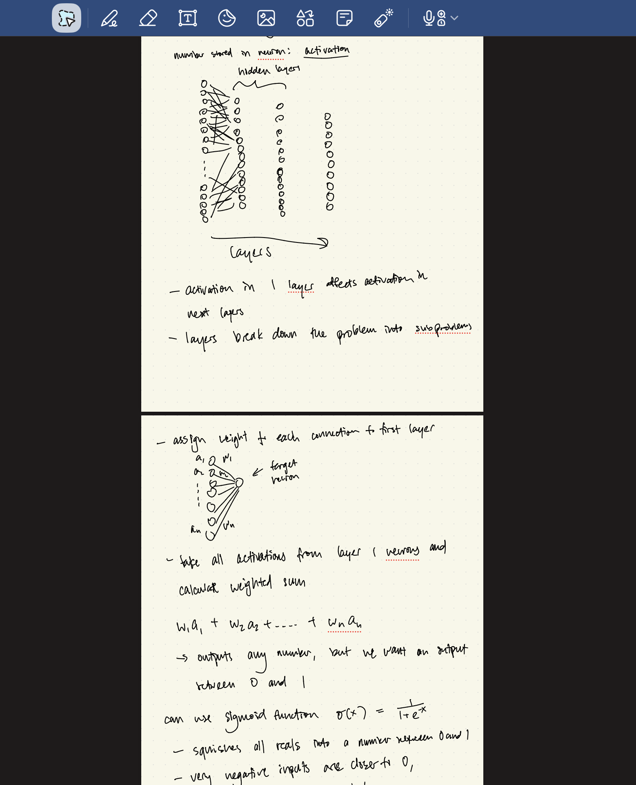
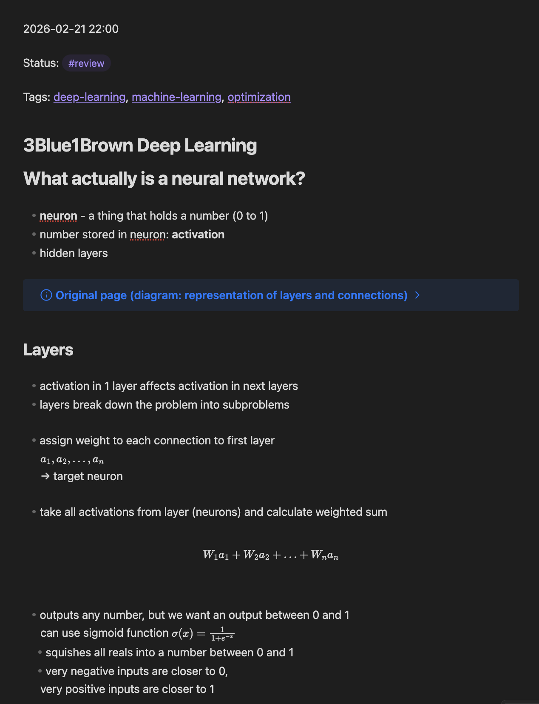

# Obsidian RAG

Obsidian RAG turns handwritten PDFs into fully formatted, interlinked Markdown notes in your Obsidian vault.

The current public release is intentionally narrow:
- OCR provider: OpenAI vision only
- Auth model: bring your own `OPENAI_API_KEY`
- Primary use case: local personal workflows on macOS or Linux

The pipeline has four stages:
- OCR renders each PDF page to an image and sends it to an OpenAI vision model to transcribe handwriting, preserve math as LaTeX, and insert diagram placeholders.
- Retrieval searches a vector index of your existing Obsidian notes using LlamaIndex and reranks results with a cross-encoder.
- Tag suggestion proposes wikilinks or hashtags from your existing vault taxonomy, with an LLM fallback when retrieval confidence is low.
- Note writing renders everything into Markdown and saves it to your Obsidian inbox folder, including saved page images for diagrams.

The index is incremental. On startup, Obsidian RAG compares your vault against a manifest and only re-embeds notes that changed. New notes created by the pipeline are also added to the index immediately so later PDFs in the same session can retrieve them.

| Handwritten PDF | Obsidian Output |
|:-:|:-:|
|  |  |

## Quick Start

This is the shortest path from clone to first processed note.

### 1. Clone the repo

```bash
git clone https://github.com/aidankcwu/obsidian-rag.git
cd obsidian-rag
```

### 2. Create a virtual environment

```bash
python3 -m venv .venv
source .venv/bin/activate
```

### 3. Install the package

```bash
pip install .
```

If you also want the local API server:

```bash
pip install .[api]
```

### 4. Install Poppler

Poppler is required for PDF rendering. Without it, OCR will fail before the first API call.

macOS:

```bash
brew install poppler
```

Ubuntu / Debian:

```bash
sudo apt install poppler-utils
```

### 5. Add your OpenAI API key

The simplest option is to keep a `.env` file in the repo while you use the tool locally:

```bash
cp .env.example .env
```

Then edit `.env` and set:

```bash
OPENAI_API_KEY=sk-your-key-here
```

You can also export the key directly in your shell instead of using `.env`.

### 6. Create your config

Run the interactive setup:

```bash
obsrag init
```

This writes config to `~/.obsrag.yaml` by default, unless a local `./.obsrag.yaml` already exists.

You will be prompted for:
- your Obsidian vault path,
- an optional watch folder for incoming PDFs,
- tag style (`wikilink` or `hashtag`),
- inbox folder name,
- tags folder name,
- attachments folder name.

### 7. Build the vault index

```bash
obsrag build
```

This reads your Obsidian vault, builds embeddings, and stores runtime state in:

```text
~/.obsrag/index
~/.obsrag/manifest.json
~/.obsrag/processed.json
```

### 8. Process your first PDF

```bash
obsrag process ~/Downloads/my_notes.pdf
```

When it finishes:
- a Markdown note is written to your configured inbox folder,
- diagram page images are saved to your configured attachments folder,
- the new note is inserted into the index for future retrieval.

### 9. Open Obsidian and review the result

Check the generated note in your inbox folder. The output should include:
- OCR’d Markdown content,
- formatted tags,
- suggested references,
- diagram callouts with embedded page images when diagrams were detected.

## What This Supports

- Handwritten PDF ingestion from the CLI
- Incremental indexing over an existing Obsidian vault
- Tag suggestions using either:
  - a tags folder (`wikilink` mode), or
  - existing hashtags found across your notes (`hashtag` mode)
- Watch-folder polling for automated PDF processing
- An optional local FastAPI server if you install `.[api]`

## What This Does Not Support

- Hosted service or managed API keys
- Google OCR in the public release
- Windows-specific setup instructions
- Guaranteed perfect handwriting recognition

## Requirements

- Python 3.10+
- An [OpenAI API key](https://platform.openai.com/api-keys)
- [Poppler](https://poppler.freedesktop.org/)
- An existing Obsidian vault

## Usage

### CLI

```bash
obsrag --help
```

| Command | Description |
|---------|-------------|
| `obsrag init` | Create `~/.obsrag.yaml` or update a local `./.obsrag.yaml` if one already exists |
| `obsrag build` | Build or rebuild the vector index from your vault |
| `obsrag sync` | Incrementally sync the index with current vault changes |
| `obsrag process <pdf>` | Process one PDF through OCR, retrieval, suggestion, and note writing |
| `obsrag suggest <note>` | Suggest and insert additional tags into an existing Markdown note |
| `obsrag watch` | Poll the configured watch folder and process new or modified PDFs |

### Build vs Sync

Use `build` when:
- you are setting the tool up for the first time,
- you want to rebuild the index from scratch,
- you suspect the persisted index is stale or corrupted.

Use `sync` when:
- you already have an index,
- you edited notes manually in Obsidian,
- you want to update only changed, added, or deleted notes.

### Process a PDF

```bash
obsrag process /absolute/path/to/file.pdf
```

This command:
1. validates your setup,
2. renders the PDF into page images,
3. OCRs each page with OpenAI vision,
4. retrieves related notes from your vault index,
5. suggests tags and references,
6. writes the final note into your inbox,
7. updates the in-memory and persisted index.

### Watch a Folder

If you configured `watch_folder`, run:

```bash
obsrag watch
```

The watcher:
- polls the folder on an interval,
- fingerprints PDFs using path, size, and mtime,
- processes newly added files,
- reprocesses modified files with the same filename.

### Suggest Tags for an Existing Note

```bash
obsrag suggest "/path/to/existing note.md"
```

This command reads the note, suggests additional tags using the same retrieval + fallback logic, and appends up to three tags to the `Tags:` line.

### Optional API

Install the API extra first:

```bash
pip install .[api]
```

Then start the server:

```bash
uvicorn api:app --host 0.0.0.0 --port 8000
```

See [docs/api.md](docs/api.md) for endpoint details.

## Configuration

Run `obsrag init`, or copy [`.obsrag.yaml.example`](.obsrag.yaml.example) to `~/.obsrag.yaml` and edit it manually.

Config lookup order:
1. local `./.obsrag.yaml`
2. `~/.obsrag.yaml`

Important defaults:
- runtime state directory: `~/.obsrag`
- index directory: `~/.obsrag/index`
- manifest path: `~/.obsrag/manifest.json`
- processed watcher log: `~/.obsrag/processed.json`
- attachments folder name: `attachments`

The most important config values are:
- `vault_path`
- `watch_folder`
- `folders.inbox`
- `folders.tags`
- `folders.attachments`
- `tags.style`
- `ocr.model`

See [docs/configuration.md](docs/configuration.md) for the full reference.

## Example Setup Notes

### Example: wikilink tags

If your vault has a folder like `3 - Tags/` and each tag is its own note:

```text
My Vault/
  1 - Inbox/
  3 - Tags/
    calculus.md
    comp182.md
    linear-algebra.md
```

Use:
- `tags.style: wikilink`
- `folders.tags: 3 - Tags`

Generated notes will then contain tags like:

```text
Tags: [[calculus]], [[linear-algebra]]
```

### Example: hashtag tags

If you do not maintain a dedicated tags folder, and you already use hashtags across your notes, switch to:

```yaml
tags:
  style: hashtag
```

Generated notes will then contain tags like:

```text
Tags: #calculus, #linear-algebra
```

## Troubleshooting

### `OPENAI_API_KEY is not set`

Add the key either:
- to your shell environment, or
- to a `.env` file next to your config file.

If your config is at `~/.obsrag.yaml`, the tool will also look for `~/.env`.

### `Poppler is required`

Install Poppler and make sure `pdftoppm` or `pdfinfo` is available on your `PATH`.

### `Vault path does not exist`

Open your config file and fix `vault_path`.

### `Tags folder does not exist`

If you are using `wikilink` mode, create the configured tags folder inside your vault.

If you do not want a tags folder, switch to:

```yaml
tags:
  style: hashtag
```

### `Only 'openai_vision' is supported`

If you have an old config from a previous version, remove `ocr.provider` or set it to:

```yaml
ocr:
  provider: openai_vision
```

### The generated note overwrote an older note

That should no longer happen. New collisions now produce a timestamp-suffixed filename. If you still see overwrites, it is a bug.

## Project Structure

```text
obsidian-rag/
├── cli.py
├── api.py
├── pyproject.toml
├── obsrag/
│   ├── config.py
│   ├── pipeline.py
│   ├── writer.py
│   ├── watcher.py
│   ├── validation.py
│   ├── openai_client.py
│   ├── ocr/
│   │   ├── vision.py
│   │   └── formatter.py
│   └── rag/
│       ├── indexer.py
│       ├── suggest.py
│       └── tags.py
├── docs/
│   ├── configuration.md
│   ├── pipeline.md
│   └── api.md
├── .env.example
└── .obsrag.yaml.example
```

## Documentation

- [Configuration Reference](docs/configuration.md)
- [Pipeline Details](docs/pipeline.md)
- [API Reference](docs/api.md)

## Release Hygiene

Before publishing, remove any checked-in secrets from git history and rotate the exposed credential that was previously stored in `gcp-key.json`. That cleanup cannot be completed safely by code changes alone.
